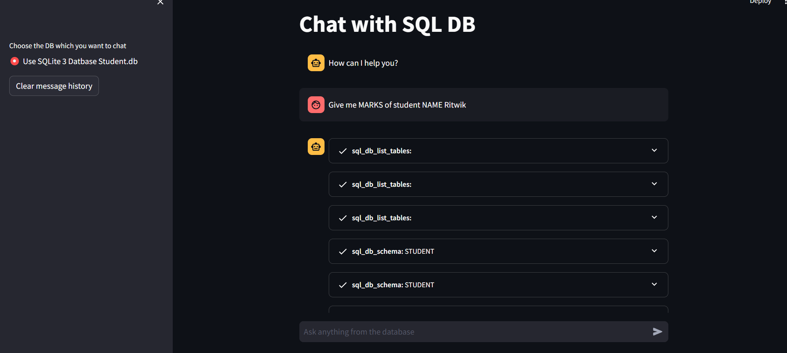
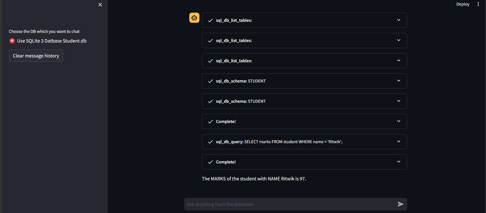
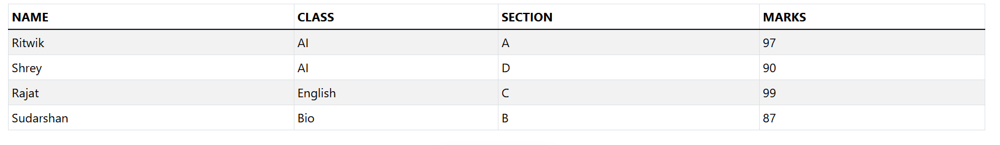

💬 Chat with SQL Database using LangChain + Streamlit

An interactive GenAI-powered SQL chatbot that allows users to query a database using natural language. Built using LangChain, Groq LLM, and Streamlit, this app translates user queries into SQL and fetches results in real time.

🚀 Features

💬 Chat-based interface (like ChatGPT)

🧠 Natural language → SQL query conversion

⚡ Powered by Groq (llama-3.1-8b-instant)

🗄️ Works with SQLite database (student.db)

🔍 Transparent reasoning with LangChain agent

♻️ Chat history with session state

🧹 Clear chat functionality

🛠️ Tech Stack

Frontend: Streamlit

Backend: Python

LLM: Groq (via LangChain)

Framework: LangChain Agents

Database: SQLite

ORM: SQLAlchemy

🚀 Live Demo

🔗 Try the app here:
https://chat-with-database-8.streamlit.app/

